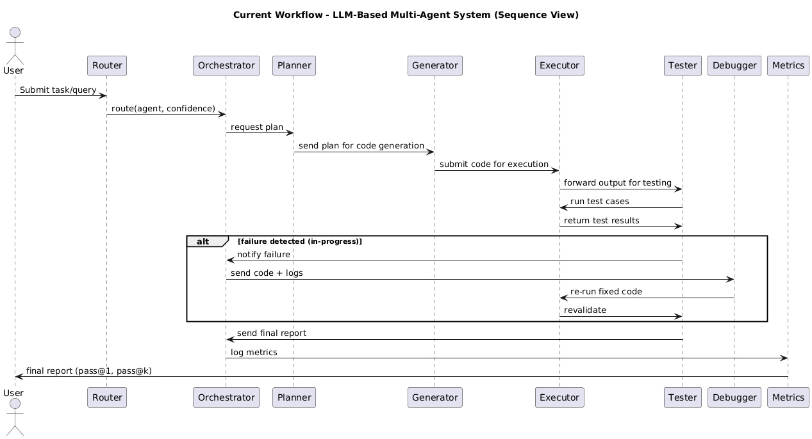
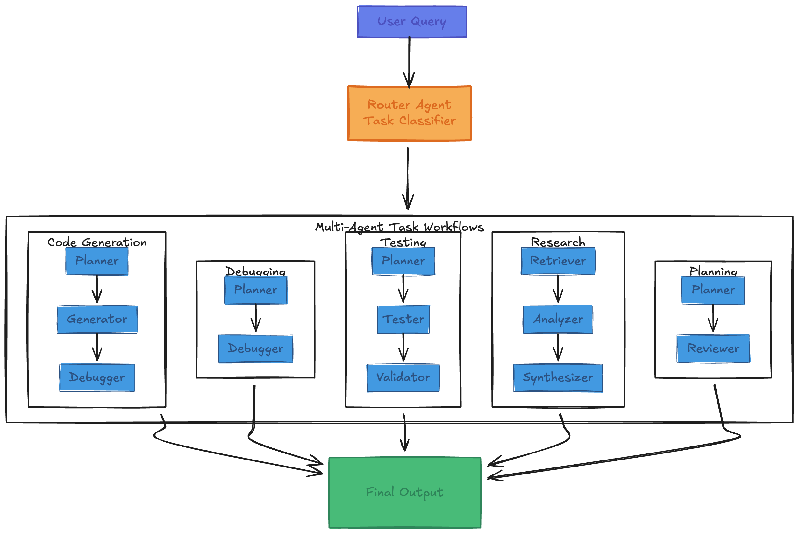
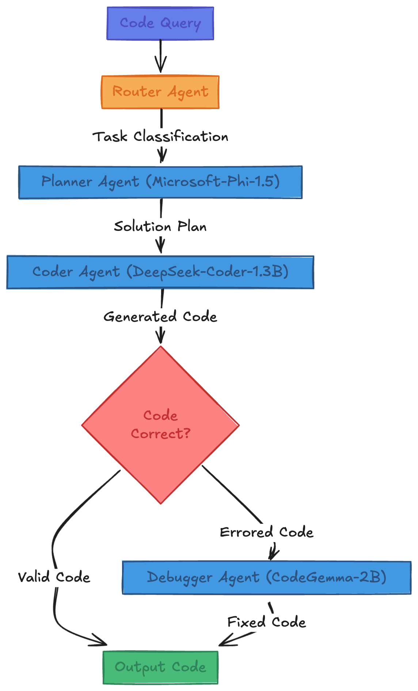
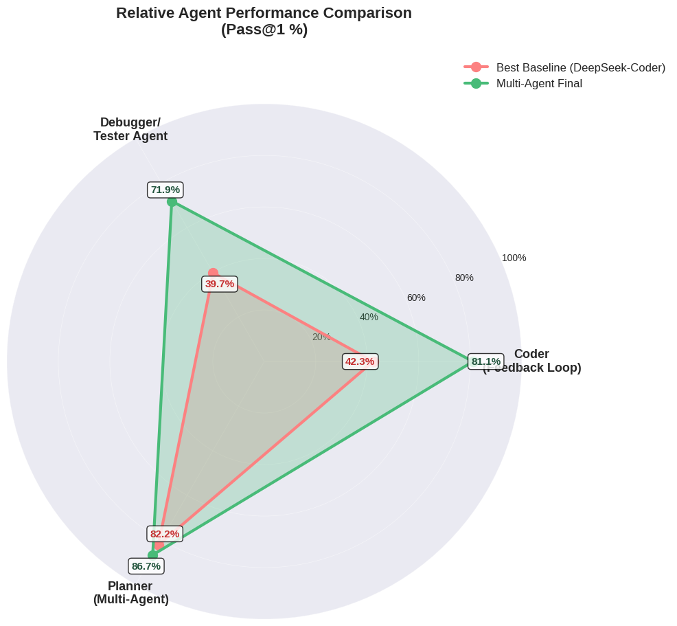
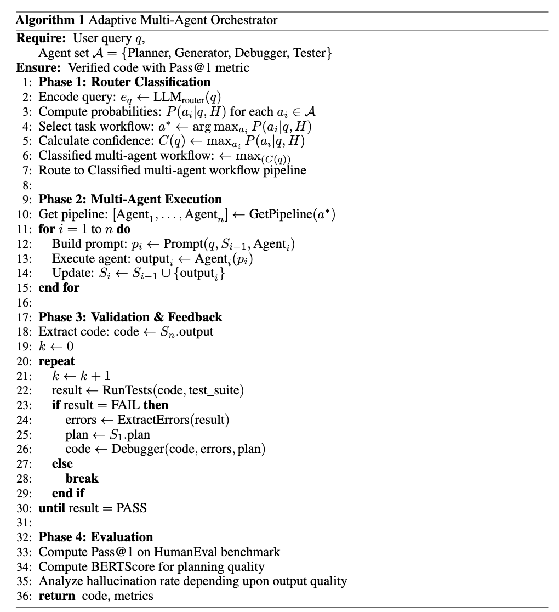
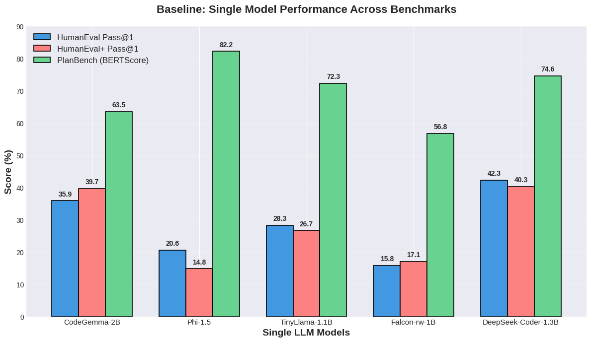
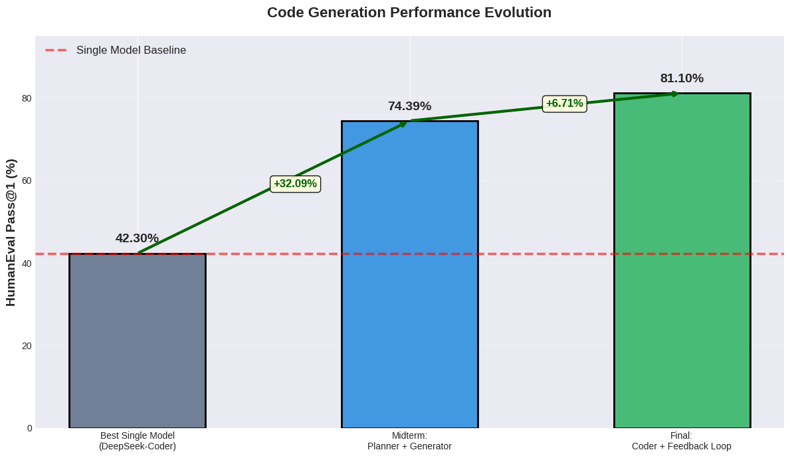
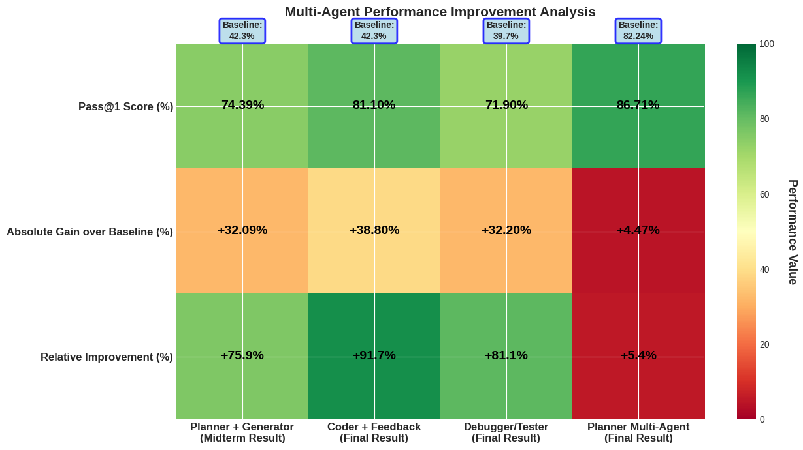

# Adaptive Multi-Agent Orchestrator (AMO)

## Overview

Adaptive Multi-Agent Orchestrator (AMO) is a role-aware LLM orchestration framework designed to improve reliability, correctness, and robustness in AI-assisted software engineering tasks.

Instead of relying on a single monolithic LLM, AMO routes tasks through specialized agents:

- Planner  
- Generator  
- Tester  
- Debugger  
- Researcher  
- Reviewer  

This modular architecture improves:

- Code correctness (Pass@1)
- Planning quality
- Debug robustness
- Hallucination reduction
- Execution transparency

---

## System Architecture

### Sequence Workflow (End-to-End Execution)

This diagram shows the full execution flow:
User → Router → Planner → Generator → Tester → Debugger → Final Output

If failures are detected, the system triggers a debug-feedback loop before producing the final result.

---

### Router Architecture

The Router classifies incoming tasks and selects the appropriate workflow based on task type and confidence score.

---

### General Multi-Agent Workflow

The Router dynamically selects one of the following workflows:

- Code Generation
- Debugging
- Testing
- Research
- Review / QA

Each workflow is modular and role-specific.

---

### Code Generation Multi-Agent Pipeline

Pipeline:

Planner → Generator → Tester → Debugger (if needed)

This ensures:

- Structured task decomposition
- Execution-based validation
- Targeted repair instead of full regeneration

---

### Multi-Agent Execution Overview

This diagram illustrates how different agents collaborate and exchange structured state information during orchestration.

---

## Algorithm

The orchestration process consists of:

1. Router classification
2. Multi-agent execution
3. Validation & debug feedback loop
4. Final evaluation (Pass@1, BERTScore)

---

## Experimental Evaluation

Benchmarks used:

- HumanEval
- HumanEval+
- PlanBench

Primary Metrics:

- Pass@1 (Code correctness)
- BERTScore (Planning quality)

---

## Multi-Agent vs Baseline Performance

The multi-agent pipeline significantly outperforms the best single-model baselines across coding and planning tasks.

---

## Code Generation Evolution

Performance progression:

- Single model baseline → 42.30%
- Planner + Generator → 74.39%
- Full Multi-Agent + Debug Loop → 81.10%

This demonstrates the impact of structured planning and iterative validation.

---

## Performance Improvement Analysis

The final multi-agent system achieves:

- +38.8% absolute improvement
- +91.7% relative improvement over baseline

Debug-feedback loops and agent specialization are the primary contributors.

---

## Key Insights

1. No single LLM performs best across all reasoning domains.
2. Planning significantly reduces logical and structural errors.
3. Debug-feedback loops improve robustness and reduce hallucination.
4. Smaller models combined via orchestration outperform monolithic systems.

---

## Future Work

- Reinforcement-based routing optimization
- Self-learning debugger
- Adaptive pipeline construction
- Meta-routing confidence tuning
- Continual memory integration

---

## Conclusion

The Adaptive Multi-Agent Orchestrator demonstrates that reliability in AI-assisted software engineering emerges from structured, modular, and verifiable multi-agent workflows rather than increasing model size alone.

Across benchmarks, AMO consistently outperforms monolithic LLM baselines in correctness, robustness, and planning quality.

---
